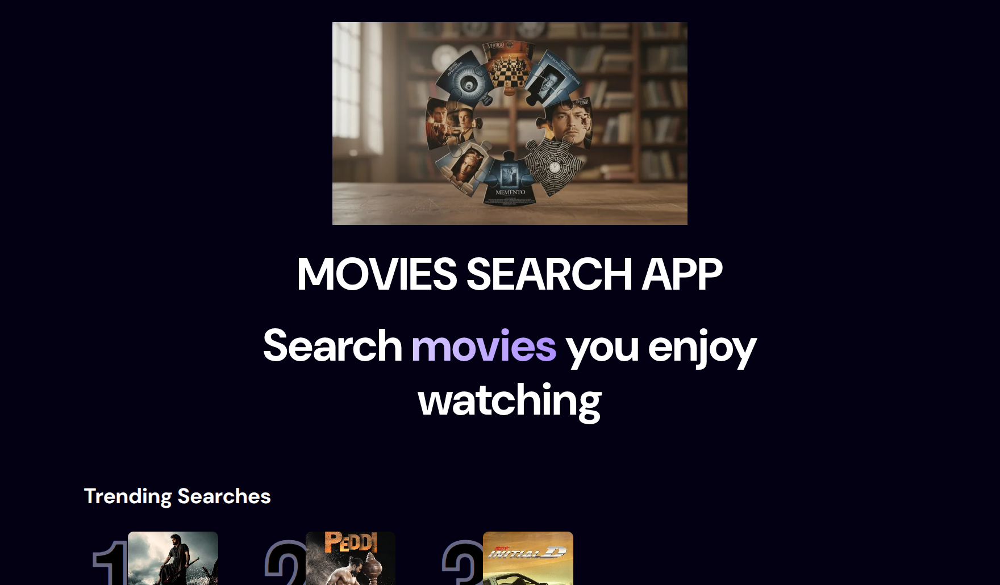
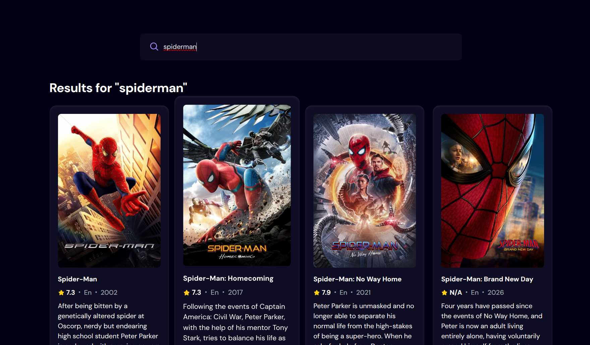
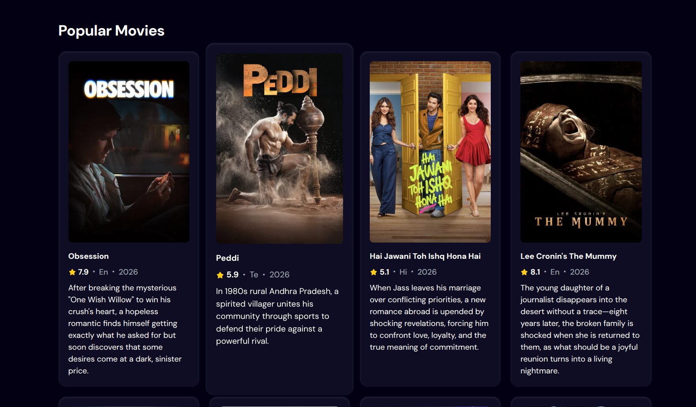
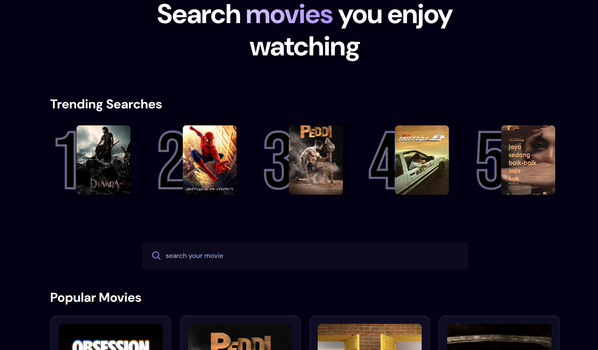

Movies Search App

A modern movie search application built with React + Vite that allows users to discover movies using the TMDB API. The app also tracks search activity using Appwrite Database to generate trending search insights.

Live Demo

Add your deployed link here
[https://your-app.vercel.app](https://movie-search-app-kappa-black.vercel.app/)

Preview

Home Page

Search Results

Movie Details View

you will get detailed view of ratings,orginal language,brief about the movie
Trending Searches

as searches increase movie becomes trending 

Features
Search movies by title in real time
Display trending and popular movies on load
View detailed movie information (poster, rating, language, release year)
Track search history using Appwrite backend
Generate trending search insights dynamically
Fully responsive design for all screen sizes
Clean and modern UI using Tailwind CSS
Tech Stack

Frontend

React
Vite
Tailwind CSS

Backend

Appwrite Database

External API

The Movie Database (TMDB)
Architecture Overview

The application follows a simple client-first architecture:

User searches for a movie
Request is sent to TMDB API
Results are displayed in UI
Search term is stored/updated in Appwrite database
Trending section fetches most searched terms
Backend (Appwrite Setup)

Appwrite is used as a lightweight analytics backend.

Database Collection Schema
Field	Type	Description
searchterm	string	Movie search keyword
count	number	Number of times searched
poster	string	Movie poster URL
Getting Started
1. Clone the repository
git clone https://github.com/your-username/movies-search-app.git
cd movies-search-app
2. Install dependencies
npm install
3. Setup environment variables

Create a .env file in the root directory:

VITE_TMDB_API_KEY=your_tmdb_api_key
VITE_APPWRITE_PROJECT_ID=your_project_id
VITE_APPWRITE_DATABASE_ID=your_database_id
VITE_APPWRITE_COLLECTION_ID=your_collection_id
4. Run the project locally
npm run dev
5. Build for production
npm run build
Project Structure
public/
  static assets (images, icons)

screenshots/
  home.png
  search.png
  details.png
  trending.png

src/
  components/
    reusable UI components

  App.jsx
  appwrite.js
  main.jsx
  index.css
Deployment

This project is ready to deploy on modern hosting platforms:

Recommended platforms:
Vercel
Netlify
Build command:
npm run build
Output directory:
dist
Performance & Optimization
Vite for fast build and HMR
Lazy API fetching for performance
Optimized state handling
Minimal re-renders in UI components
Environment Variables

Make sure the following variables are configured:

Variable	Description
VITE_TMDB_API_KEY	API key for TMDB
VITE_APPWRITE_PROJECT_ID	Appwrite project ID
VITE_APPWRITE_DATABASE_ID	Appwrite database ID
VITE_APPWRITE_COLLECTION_ID	Appwrite collection ID
Git Ignore
node_modules/
dist/
.env
Roadmap
Add user authentication (Appwrite Auth)
Save favorite movies
Add infinite scrolling for results
Improve trending algorithm with time-based ranking
Dark/Light theme toggle
Author

Your Name
GitHub: https://github.com/your-username
Portfolio: https://your-portfolio.com

License

This project is licensed under the MIT License.
